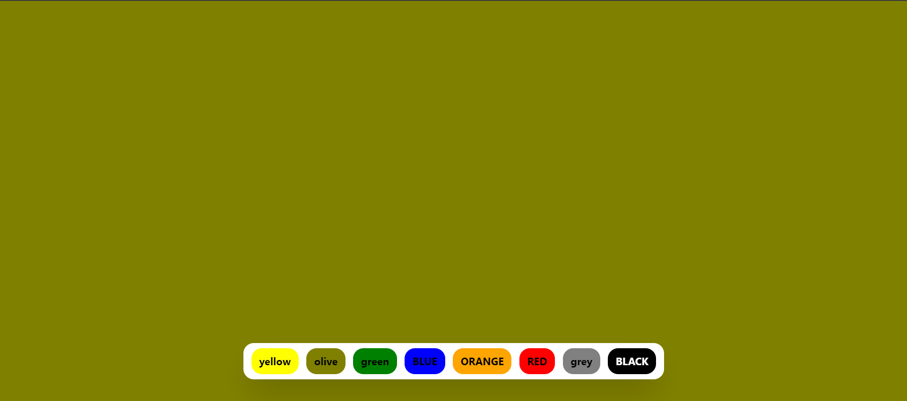

# Background Generator

This is a simple background generator built using React. It allows users to change the background color of the webpage by selecting from a variety of color options.

## Features

- Change the background color of the webpage by clicking on color buttons.
- Smooth transition effect when changing the background color.
- Easy-to-use interface with color options displayed in buttons.

## Technologies Used

- React.js
- Tailwind CSS

## Preview

